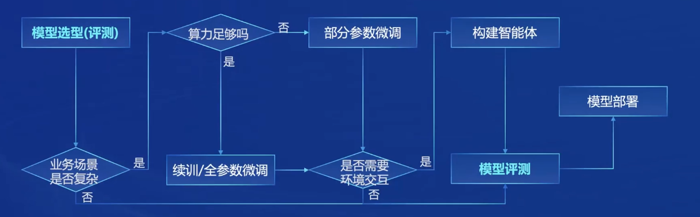

# 专用模型与通用大模型

## 专用模型
针对特定任务，一个模型解决一个问题。

## 通用大模型
一个模型应对多种任务、多种模态。

# 模态
模态是指数据的不同形式或类型，如文本、图像、音频等。在机器学习和人工智能领域，处理不同模态的数据需要不同的模型或同一模型的不同部分。

# 大模型的重要性
大模型是通往人工智能的一个关键途径。

# 书生.浦语大模型开源历程

# InternLM2的体系

# 从模型到应用典型流程

# 全链条开源开放体系
全链条开源开放体系指的是从数据、预训练、微调到部署、测评和应用。

## 数据
数据集获取：[opendatalab.org.cn](http://opendatalab.org.cn)

## 预训练
高可扩展、极致性能优化、兼容主流、开箱即用。

### HuggingFace等技术生态
HuggingFace是一个著名的开源社区和公司，提供了大量的自然语言处理（NLP）工具和预训练模型，尤其是Transformer模型。它的核心产品是Transformers库，用户可以轻松地加载、训练和微调各种NLP模型。其他技术生态包括TensorFlow、PyTorch、OpenAI等，这些都是机器学习和人工智能领域的重要工具和平台。

## 微调

### 增量续训
增量续训指在已有模型的基础上，继续用新数据进行训练，以提高模型在新任务或新数据上的表现。

### 有监督微调
有监督微调是利用带标签的数据对模型进行进一步训练，以提高模型在特定任务上的性能。

## 评测
司南大模型评测体系。

## 部署

## 智能体
Lagent支持多种类型的智能体能力，Agentlego多模态智能体工具箱。

智能体（Agent）是指在特定环境中自主行动并执行任务的计算实体。智能体可以是软件程序、机器人或虚拟助手。在需要自动化处理、决策和执行任务的场景下会用到智能体，如自动驾驶、虚拟客服、智能家居等。

